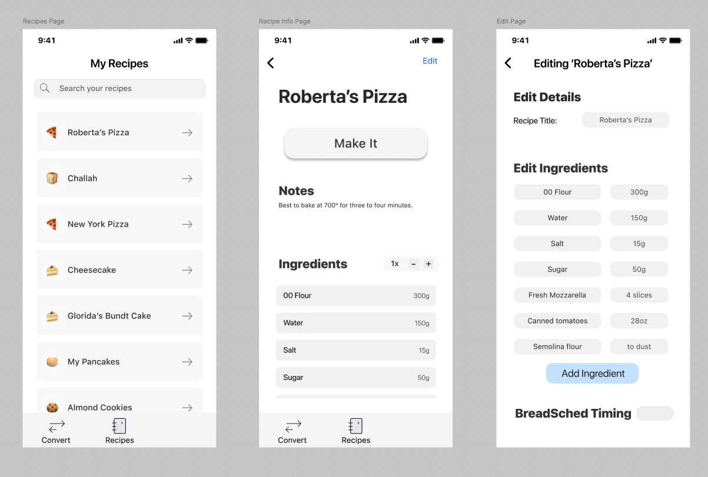

# Baking Buddy / BreadSched v2

This repository holds a work-in-progress app inspired by a baking schedule builder I created a few years ago.
The idea is that it stores your recipes for you, notes on baking, and, the killer feature --- will automatically create a schedule
that lays out your baking timing --- when to start, what time the first rise will be done, etc. See [BreadSched](https://github.com/jakebox/breadsched) for that idea.

Frontend: React Native
Backend: Node.js (Express)

